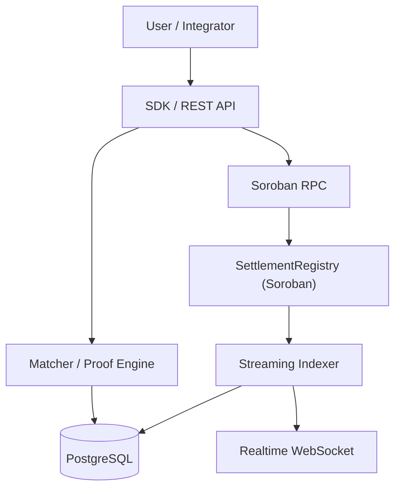

# StellarClear

<div align="center">

<p align="center">
  
</p>

[](https://github.com/StellarClear/stellarclear-app/actions/workflows/ci.yml)
[](./LICENSE)
[](https://www.typescriptlang.org/)
[](https://stellar.org/soroban)
[](https://github.com/StellarClear/stellarclear-app/releases/tag/v0.1.1)

StellarClear is a non-custodial settlement verification protocol for Stellar that reconciles expected financial obligations with actual on-chain payments, records independent observer attestations, handles disputes, and anchors settlement evidence on Soroban.

</div>

> **Non-Custodial Boundary**: StellarClear **is not** a banking platform, payment processor, custodial service, or escrow platform. StellarClear **never** moves or takes custody of participant funds. All token and asset transfers execute directly between counterparties' own Stellar accounts. StellarClear operates exclusively as an off-chain reconciliation engine, proof generator, and on-chain evidentiary state anchor.

---

## Quick Links

| Resource | Link | Description |
| :--- | :--- | :--- |
| **Documentation Site** | [`https://stellarclear.github.io/stellarclear-app/`](https://stellarclear.github.io/stellarclear-app/) | Authoritative public documentation, guides, and specifications |
| **Smart Contract Repository** | [`StellarClear/stellarclear-contract`](https://github.com/StellarClear/stellarclear-contract) | Rust Soroban `SettlementRegistry` contract implementation |
| **Latest Release** | [`Application v0.1.1`](https://github.com/StellarClear/stellarclear-app/releases/tag/v0.1.1) | Pinned application release package and changelog |
| **Stellar Testnet Contract** | [`CCPCMPIUTKBLSJVSGPPSUHTBBY6HHT3OTE3CKUXC5BD2B3YEDSAROGC5`](https://stellar.expert/explorer/testnet/contract/CCPCMPIUTKBLSJVSGPPSUHTBBY6HHT3OTE3CKUXC5BD2B3YEDSAROGC5) | Active hardened contract deployed on Stellar Testnet |
| **Contract Explorer** | [StellarExpert Explorer](https://stellar.expert/explorer/testnet/contract/CCPCMPIUTKBLSJVSGPPSUHTBBY6HHT3OTE3CKUXC5BD2B3YEDSAROGC5) | Live on-chain contract transactions, state, and ledger history |
| **API Reference** | [REST API Docs](https://stellarclear.github.io/stellarclear-app/reference/api.html) (Local: [`docs/api.md`](./docs/api.md)) | Endpoints, request/response schemas, and idempotency semantics |
| **Security Policy** | [`SECURITY.md`](./SECURITY.md) | Vulnerability disclosure policy and security posture |
| **Contributing Guide** | [`CONTRIBUTING.md`](./CONTRIBUTING.md) | Development workflow, commit conventions, and testing guidelines |
| **Submission Package** | [`SUBMISSION_PACKAGE.md`](./SUBMISSION_PACKAGE.md) | Verified technical submission metadata and testnet execution evidence |

---

## Project Status

| Metric | Status | Details |
| :--- | :--- | :--- |
| **Application Release** | `v0.1.1` | Packaged monorepo (API, indexer, matcher, proof, SDK) |
| **Contract Release** | `v0.1.1` | Pinned Soroban `SettlementRegistry` (Commit `2032666`) |
| **Network** | Stellar Testnet | RPC: `https://soroban-testnet.stellar.org` |
| **Active Contract ID** | `CCPCMPIUTKBLSJVSGPPSUHTBBY6HHT3OTE3CKUXC5BD2B3YEDSAROGC5` | Deployed at ledger `5048699` |
| **Testnet Status** | Deployed & Verified | 7/7 lifecycle flows verified on-chain (`testnet-evidence.json`) |
| **Documentation** | Live | Hosted via GitHub Pages at [`stellarclear.github.io/stellarclear-app`](https://stellarclear.github.io/stellarclear-app/) |
| **Security Status** | Unaudited | Active development; formal third-party audit pending |

> **Note**: StellarClear is currently deployed on Stellar Testnet. This Testnet deployment is intended for integration verification and testing, not production mainnet finance.

---

## What Exists Today

The StellarClear repository contains a complete, verified settlement verification stack:

1. **Soroban `SettlementRegistry` Contract**: On-chain state anchor recording cryptographic commitments, observer registries, breaks, disputes, and finalizations.
2. **TypeScript SDK (`packages/sdk`)**: Client library providing typed contract bindings, error normalization, and M-of-N observer quorum verification.
3. **Deterministic Matcher (`services/matcher`)**: Decimal-accurate arithmetic reconciliation engine identifying clean matches and standardized breaks.
4. **REST API (`services/api`)**: High-throughput Fastify dispatcher for case ingestion, dispute workflows, attestation management, and operational diagnostics.
5. **PostgreSQL Persistence (`packages/db`)**: Storage layer with idempotent insert guards, cursor tracking, and state deduplication.
6. **Streaming Event Indexer (`services/indexer`)**: Event ingestion service tracking Soroban RPC events with durable checkpoint recovery.
7. **Realtime WebSocket Stream**: Live WebSocket event subscription stream for instant state synchronization.
8. **Cryptographic Proof Package (`packages/proof`)**: RFC 8785 canonical JSON serializer and collision-resistant SHA-256 commitment generator.
9. **Verified Testnet Deployment**: Live deployment on Stellar Testnet verified with real transaction evidence across all lifecycle scenarios.
10. **Public Documentation Site**: Standalone VitePress documentation site deployed to GitHub Pages.

> **Web dashboard**: Planned as a post-release product layer. The current release exposes the protocol through the SDK, API, indexer, realtime stream, and Soroban contract.

---

## How StellarClear Works

### Settlement Lifecycle

StellarClear reconciles trade expectations against actual Stellar payments using a deterministic state machine:

```text
Expected settlement
      │
      ▼
Actual Stellar transaction
      │
      ▼
Observation recorded
      │
      ▼
Deterministic reconciliation
      │
      ├───────────────────────────────┐
      ▼                               ▼
   MATCHED                          BREAK
      │                               │
      │                               ▼
      │                            DISPUTED
      │                               │
      │              ┌────────────────┴────────────────┐
      │              ▼                                 ▼
      │      Mutual Resolution                 Dispute Expiration
      │              │                                 │
      │              ▼                                 ▼
      │           RESOLVED                           BREAK
      │              │                                 │
      └──────────────┼─────────────────────────────────┘
                     ▼
           Observer attestations
                     │
                     ▼
           M-of-N quorum check
                     │
                     ▼
               FINALIZED (Immutable)
```

1. **Expected Settlement (`OPEN`)**: Case owner registers trade parameters (parties, amount, asset, destination, deadline). A canonical SHA-256 hash (`termsCommitment`) is anchored on Soroban via `create_case`.
2. **Transaction Observation (`OBSERVED`)**: When a counterparty executes a standard payment on Stellar, payment details are ingested and an `observationCommitment` is anchored on Soroban via `record_observation`.
3. **Deterministic Reconciliation (`MATCHED` or `BREAK`)**: The matcher verifies amount, asset, destination, reference, and deadline.
   - **Clean Match**: Case transitions to `MATCHED`.
   - **Discrepancy**: Case transitions to `BREAK` with a standardized `BreakCode` recorded on Soroban via `record_break`.
4. **Dispute & Resolution Path (If Break occurs)**:
   - Either counterparty can submit supporting evidence to enter `DISPUTED` via `open_dispute`.
   - **Mutual Resolution**: Both parties must submit matching resolution commitments before transitioning to `RESOLVED`. A single resolution submission remains `DISPUTED`.
   - **Dispute Expiration**: If an optional TTL ledger bound expires without mutual resolution, any participant can invoke `expire_dispute` to return the case to `BREAK`.
5. **Attestation & Quorum Verification**: Owner, counterparty, and authorized independent observers submit cryptographic signatures (`CaseAttested`).
6. **Finalization (`FINALIZED`)**: The contract verifies that the required `M-of-N` distinct observer quorum is satisfied. `finalize_case` immutably seals the record against further state modifications.

---

## Why StellarClear

StellarClear provides institutional-grade settlement guarantees through these core properties:

- **Non-Custodial**: Operates strictly as an evidentiary oracle and reconciliation layer without ever taking possession of user tokens or running custodial escrows.
- **Deterministic Reconciliation**: Evaluates exact decimal amounts and parameters without floating-point error or heuristic ambiguity.
- **Cryptographic Commitments**: Stores canonical SHA-256 hashes on-chain, preserving commercial privacy while proving trade term integrity.
- **Independent M-of-N Observer Quorum**: Requires threshold signatures from registered third-party observers, preventing unilateral finalization.
- **Historical Attestation Integrity**: Valid observer attestations remain permanently recorded and respected even if an observer key is subsequently revoked.
- **Dispute State Machine**: Supports structured contestation with evidence hashes and strictly guarded status progressions.
- **Ledger-Based Dispute Expiration**: Enforces explicit ledger-sequence deadlines to prevent contested settlements from stalling indefinitely.
- **Immutable Finalization**: Once sealed on Soroban, finalized settlement cases cannot be reopened, overwritten, or modified.
- **Replay-Safe Indexing**: Idempotent event cursors and database constraints prevent duplicated state transitions on RPC reconnections.
- **Portable Verification Evidence**: Generates self-contained JSON `SettlementProof` artifacts verifiable offline and against live Soroban state.

---

## Architecture



### Component Roles

- **Soroban Smart Contract (`SettlementRegistry`)**: The authoritative protocol state anchor on Stellar. Manages commitments, state progressions, observer whitelisting, and finalization immutability.
- **PostgreSQL Database (`packages/db`)**: Durable indexed projection providing low-latency querying, idempotent updates, and historical audit storage.
- **Proof Package (`packages/proof`)**: Deterministic canonical JSON serialization (`RFC 8785`) and SHA-256 commitment computation engine.
- **Streaming Indexer (`services/indexer`)**: Event ingestion engine reading Soroban contract events, maintaining cursor checkpoints, and broadcasting real-time updates.
- **Client SDK & REST API (`packages/sdk`, `services/api`)**: High-throughput access layer enabling case creation, observation ingestion, dispute coordination, and operational telemetry.

---

## Live Testnet

The active hardened contract is deployed on Stellar Testnet and verified against the authoritative release artifact:

| Property | Value |
| :--- | :--- |
| **Network** | Stellar Testnet (`https://soroban-testnet.stellar.org`) |
| **Active Contract ID** | `CCPCMPIUTKBLSJVSGPPSUHTBBY6HHT3OTE3CKUXC5BD2B3YEDSAROGC5` |
| **Contract Release** | `v0.1.1` (Commit `2032666`) |
| **WASM SHA-256** | `0073a4cb2027140ac34e4db6c64c2d4104590ec60cf0ef2e424909eba9ae36ac` |
| **Bytecode Size** | 32,773 bytes |
| **Deployment Ledger** | `5048699` |
| **Explorer Link** | [StellarExpert Contract Explorer](https://stellar.expert/explorer/testnet/contract/CCPCMPIUTKBLSJVSGPPSUHTBBY6HHT3OTE3CKUXC5BD2B3YEDSAROGC5) |
| **Historical Prototype** | `CDLZFC3SYJYDZT7K67VZ75HPJVIEUVNIXF47ZG2FB2RMQQVU2HHGCYSC` *(v0.1.0 prototype preserved for provenance)* |

### Verified On-Chain Scenarios

All 7 protocol lifecycle flows have been executed and verified against `CCPCMPIUTKBLSJVSGPPSUHTBBY6HHT3OTE3CKUXC5BD2B3YEDSAROGC5`:

- **Flow A (Clean Match)**: Full pipeline (`create_case` &rarr; `observe` &rarr; `match` &rarr; `attest` &rarr; `finalize`) &mdash; [Tx `a488dd...`](https://stellar.expert/explorer/testnet/tx/a488dd6ae980fb7c36734b9fe7d9132955a6b480bcaf4da7b6883bdf75057081)
- **Flow B (Negative Quorum)**: Finalization blocked with `ObserverQuorumNotMet (Error #19)` when 2/3 observers attest &mdash; [Tx `b26da2...`](https://stellar.expert/explorer/testnet/tx/b26da2ac773cc89bbdf218123bc4e03c5f7ea6889b1c85e6fcc7c64b2a348e9e)
- **Flow C (M-of-N Quorum)**: Finalization succeeded with quorum 2 satisfied by observers 2 & 3 without initial observer &mdash; [Tx `874217...`](https://stellar.expert/explorer/testnet/tx/874217b5f3ed23ad80d245be9e87bdef767eb0229495b562d04ff19902db4869)
- **Flow D (Observer Revocation)**: Historical attestation retained in storage after observer revocation &mdash; [Tx `0a3620...`](https://stellar.expert/explorer/testnet/tx/0a3620f61afb0b991cb79cb079586b0ea8bb147e7d42fe9091254c9ec43f09b6)
- **Flow E (Dispute & Mutual Resolution)**: 1st resolution retained `DISPUTED`; 2nd matching resolution transitioned to `RESOLVED` &mdash; [Tx `0f9018...`](https://stellar.expert/explorer/testnet/tx/0f9018a6fbc577c765c6701e3d81781fa44ba702c5cd2d59cff25f451c7955e7)
- **Flow F (Dispute Expiration TTL)**: Premature expiration rejected with `DisputeNotExpired (Error #20)` until TTL elapsed &mdash; [Tx `cdaa30...`](https://stellar.expert/explorer/testnet/tx/cdaa30dc13c314117cf3cadde1d375b3d27309a81188b4a393b7a0e33c5c0552)
- **Flow G (Finalized Immutability)**: Post-finalization mutations rejected with `InvalidState (Error #7)` &mdash; [Tx `438c1e...`](https://stellar.expert/explorer/testnet/tx/438c1eb040117b6b251e8fa6c7c5693d117886bf1e2879b997a71e32cece57a9)

Detailed transaction hashes and verification payloads are recorded in [`testnet-evidence.json`](./testnet-evidence.json) and [`SUBMISSION_PACKAGE.md`](./SUBMISSION_PACKAGE.md).

---

## Documentation

The authoritative public documentation is available on the live documentation site:

**[https://stellarclear.github.io/stellarclear-app/](https://stellarclear.github.io/stellarclear-app/)**

### Documentation Map

| Area | Online Documentation | Repository Source |
| :--- | :--- | :--- |
| **Architecture & Concepts** | [Architecture Guide](https://stellarclear.github.io/stellarclear-app/getting-started/architecture.html) | [`docs/architecture.md`](./docs/architecture.md) |
| **Settlement Lifecycle** | [Lifecycle State Machine](https://stellarclear.github.io/stellarclear-app/protocol-concepts/lifecycle.html) | [`docs/settlement-lifecycle.md`](./docs/settlement-lifecycle.md) |
| **Break Taxonomy** | [Reconciliation Breaks](https://stellarclear.github.io/stellarclear-app/protocol-concepts/break-taxonomy.html) | [`docs-site/protocol-concepts/break-taxonomy.md`](./docs-site/protocol-concepts/break-taxonomy.md) |
| **Client SDK** | [TypeScript SDK Guide](https://stellarclear.github.io/stellarclear-app/developer-guide/sdk.html) | [`packages/sdk/`](./packages/sdk/) |
| **REST API** | [REST API Reference](https://stellarclear.github.io/stellarclear-app/reference/api.html) | [`docs/api.md`](./docs/api.md) |
| **Contract Integration** | [Soroban Integration](https://stellarclear.github.io/stellarclear-app/reference/contract.html) | [`docs/soroban-integration.md`](./docs/soroban-integration.md) |
| **Independent Observers** | [Observer Onboarding Guide](https://stellarclear.github.io/stellarclear-app/user-guides/independent-observer.html) | [`docs-site/user-guides/independent-observer.md`](./docs-site/user-guides/independent-observer.html) |
| **Deployment & Ops** | [Production Operations](https://stellarclear.github.io/stellarclear-app/developer-guide/operations.html) | [`docs/operations.md`](./docs/operations.md), [`docs/deployment.md`](./docs/deployment.md) |
| **Release Runbook** | [Release Procedures](https://stellarclear.github.io/stellarclear-app/developer-guide/environment.html) | [`docs/production-release-procedure.md`](./docs/production-release-procedure.md) |
| **Security Policy** | [Security Specification](https://stellarclear.github.io/stellarclear-app/community/security.html) | [`SECURITY.md`](./SECURITY.md) |
| **Contributing** | [Contributor Guide](https://stellarclear.github.io/stellarclear-app/community/contributing.html) | [`CONTRIBUTING.md`](./CONTRIBUTING.md) |

---

## Quick Start

### Prerequisites

- **Node.js**: `>=22.12.0`
- **npm**: `>=10.0.0`
- **Docker & Docker Compose**: (Optional, for multi-service container runtime)

### Setup & Installation

```bash
# 1. Clone the repository
git clone https://github.com/StellarClear/stellarclear-app.git
cd stellarclear-app

# 2. Install reproducible dependencies
npm ci

# 3. Build all workspace packages and services
npm run build

# 4. Run TypeScript strict typecheck
npm run typecheck

# 5. Run the complete test suite (234 tests across 63 suites)
npm test
```

### Running Services Locally

#### Option A: Standalone Service Scripts

```bash
# Copy example configuration
cp .env.example .env

# Start the REST API service (default: port 3000)
npm run start:api

# Start the streaming indexer service
npm run start:indexer
```

#### Option B: Multi-Service Docker Topology

The repository includes a production-ready container composition running PostgreSQL, the REST API, and the streaming indexer:

```bash
# Start PostgreSQL, API service, and Indexer service
docker compose up -d

# Verify service logs
docker compose logs -f api
```

#### Option C: Documentation Site

```bash
# Start local documentation dev server
npm run docs:dev

# Build static documentation site for deployment
npm run docs:build
```

---

## Example Usage

### 1. Client SDK Initialization

```typescript
import { StellarClearClient, Networks } from "@stellarclear/sdk";

// Initialize client with active Testnet contract
const client = new StellarClearClient({
  network: "testnet",
  networkPassphrase: Networks.TESTNET.networkPassphrase,
  rpcUrl: "https://soroban-testnet.stellar.org",
  contractId: "CCPCMPIUTKBLSJVSGPPSUHTBBY6HHT3OTE3CKUXC5BD2B3YEDSAROGC5",
});

// Generate deterministic case ID
const caseId = client.generateCaseId(
  "GBRPYHIL2CI3FNQ4BXLFMNDLFJUNPU2HY3ZMFTGOBKGOTQTV4HXY5SLQ",
  "GA5ZSEJYB37JRC5AVCIA5MOP4RHTM335X2KGX3IHOJAPP5RE34K4KZVN",
  "TRADE-EURUSD-001"
);

// Query on-chain settlement state
const onchainCase = await client.getCase(caseId);
console.log("On-chain Status:", onchainCase?.status);
```

### 2. REST API Case Creation (`POST /v1/cases`)

```bash
curl -X POST http://localhost:3000/v1/cases \
  -H "Content-Type: application/json" \
  -d '{
    "expected": {
      "caseId": "1212121212121212121212121212121212121212121212121212121212121212",
      "owner": "GBRPYHIL2CI3FNQ4BXLFMNDLFJUNPU2HY3ZMFTGOBKGOTQTV4HXY5SLQ",
      "counterparty": "GA5ZSEJYB37JRC5AVCIA5MOP4RHTM335X2KGX3IHOJAPP5RE34K4KZVN",
      "tradeReference": "TRADE-EURUSD-001",
      "asset": "EURC:GBBD47IF6LWK7P7MDEVSCWR7DPUWV3NY3DTQEVFL4NAT4AQH3ZLLFLA5",
      "amount": "1000.0000000",
      "expectedDestination": "GBRPYHIL2CI3FNQ4BXLFMNDLFJUNPU2HY3ZMFTGOBKGOTQTV4HXY5SLQ",
      "reference": "INV-2026-001",
      "deadline": 2000000
    }
  }'
```

---

## Verification

The repository enforces end-to-end quality through automated verification suites:

| Verification Gate | Command | Scope & Results |
| :--- | :--- | :--- |
| **Strict Typecheck** | `npm run typecheck` | Monorepo-wide TypeScript type safety without errors |
| **Unit Test Suite** | `npm run test:unit` | 73 tests covering schemas, proof canonicalization, matcher arithmetic, DB client, and SDK |
| **API Test Suite** | `npm run test:api` | Endpoint validation, case ingestion, and operational health probes |
| **Security Regression** | `npm run test:security` | Adversarial attacks, input boundary fuzzing, replay attacks, and idempotency isolation |
| **Indexer Test Suite** | `npm run test:indexer` | Event decoding, cursor checkpoints, and WebSocket event distribution |
| **Integration Suite** | `npm run test:integration` | End-to-end lifecycles and simulated Soroban contract invocations |
| **Full Release Pipeline** | `npm run verify:release` | 8-stage comprehensive pre-flight verification pipeline (**100% pass across all 234 tests**) |
| **Live Testnet E2E** | Live execution | Real on-chain flows A through G recorded in [`testnet-evidence.json`](./testnet-evidence.json) |

---

## Release

| Layer | Release Tag | Repository | Description |
| :--- | :--- | :--- | :--- |
| **Application Layer** | [`v0.1.1`](https://github.com/StellarClear/stellarclear-app/releases/tag/v0.1.1) | `StellarClear/stellarclear-app` | Off-chain API, indexer, matcher, proof engine, and client SDK |
| **Contract Layer** | [`v0.1.1`](https://github.com/StellarClear/stellarclear-contract/releases/tag/v0.1.1) | `StellarClear/stellarclear-contract` | Authoritative Soroban `SettlementRegistry` contract and state machine |

### Repository Relationship

- **`stellarclear-app`**: Manages off-chain computation, REST ingestion, relational PostgreSQL indexing, deterministic matching, cryptographic proof construction, and client SDK bindings.
- **`stellarclear-contract`**: Hosts the immutable Soroban smart contract anchoring SHA-256 commitments, whitelisting observers, enforcing M-of-N quorum, and locking finalized settlements.

---

## Security

Security and cryptographic integrity are paramount to the StellarClear protocol:

- **Security Policy**: Detailed in [`SECURITY.md`](./SECURITY.md).
- **Vulnerability Disclosure**: Please report security vulnerabilities via GitHub Private Vulnerability Reporting or by contacting our team at [`security@stellarclear.io`](mailto:security@stellarclear.io) / [`adejumooluwasegun35@gmail.com`](mailto:adejumooluwasegun35@gmail.com). Do not open public issues for security vulnerabilities.
- **Audit Status**: Unaudited. StellarClear is under active development and has not yet undergone a formal third-party audit. It should not be used with real production mainnet funds prior to an independent security audit.
- **Credential Protection**: Private signing keys and secret seeds are never committed to the repository. Testnet credentials must remain strictly local.

---

## Contributing

We welcome community contributions to StellarClear. Please refer to [`CONTRIBUTING.md`](./CONTRIBUTING.md) for full guidelines:

- **Issue Workflow**: Check [open issues](https://github.com/StellarClear/stellarclear-app/issues) labeled `good first issue` or `help wanted` and request assignment before beginning work.
- **Branch Naming**: Use descriptive branch names (e.g., `feat/dispute-ttl`, `fix/cursor-boundary`).
- **Commit Conventions**: Follow [Conventional Commits](https://www.conventionalcommits.org/) (`feat:`, `fix:`, `docs:`, `test:`, `chore:`, `refactor:`).
- **Verification Gates**: Run `npm run typecheck && npm test && npm run verify:release` locally prior to submitting pull requests.

---

## Roadmap

### Current Release (`v0.1.1`)
- Core Soroban `SettlementRegistry` state machine with M-of-N observer quorum.
- Deterministic reconciliation matcher with standardized `BreakCode` taxonomy.
- Canonical JSON serialization (`RFC 8785`) and SHA-256 settlement proof generator.
- Streaming indexer with cursor recovery and real-time WebSocket subscriptions.
- Fastify REST API with operational diagnostics and health probes.
- Pinned Stellar Testnet deployment with verified on-chain evidence.

### Post-Release Enhancements (Planned)
- **Web Dashboard**: Planned as a post-release product layer for browser-based settlement monitoring and dispute visualization.
- **Prometheus Telemetry**: Native Prometheus text exposition endpoint (`/metrics` &mdash; Issue [#18](https://github.com/StellarClear/stellarclear-app/issues/18)).
- **RPC Error Recovery**: Adaptive exponential backoff with jitter for Soroban RPC rate-limit resilience (Issue [#19](https://github.com/StellarClear/stellarclear-app/issues/19)).
- **Multi-Chain Event Anchoring**: Cross-reference connectors for external settlement networks.

> **Dashboard Status**: A web dashboard is **PLANNED** for a future release. There is no deployed or hosted browser interface in v0.1.1.

---

## Ecosystem & Wave Submission

StellarClear is prepared for Stellar Wave submission in the Drips ecosystem:

- **Application Monorepo**: [`StellarClear/stellarclear-app`](https://github.com/StellarClear/stellarclear-app)
- **Smart Contract Monorepo**: [`StellarClear/stellarclear-contract`](https://github.com/StellarClear/stellarclear-contract)
- **Authoritative Submission Package**: [`SUBMISSION_PACKAGE.md`](./SUBMISSION_PACKAGE.md)
- **Public Documentation Site**: [`https://stellarclear.github.io/stellarclear-app/`](https://stellarclear.github.io/stellarclear-app/)

---

## License

Apache-2.0 &mdash; see [`LICENSE`](./LICENSE) for details.
