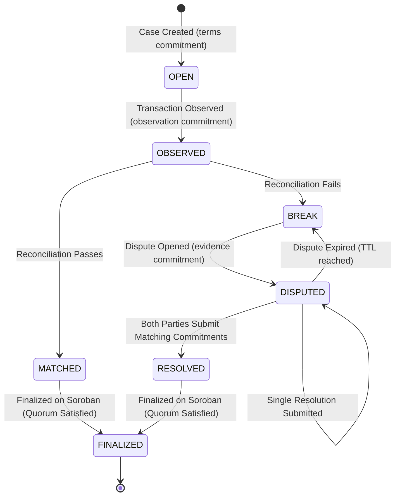
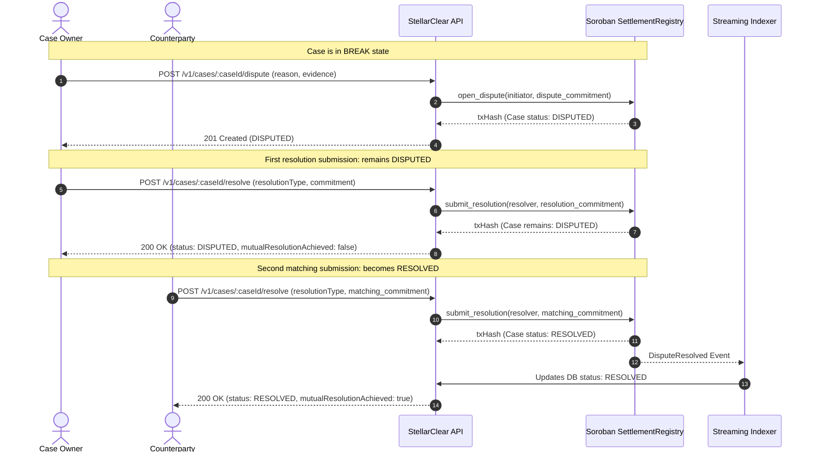

# Settlement Lifecycle & Break Taxonomy

This document describes the state machine, lifecycle stages, break taxonomy, and dispute workflows for StellarClear settlements.

## State Machine

---

## Lifecycle Stages

### 1. Case Creation (`OPEN`)
- **Initiator**: Case Owner / Trade Originator.
- **Off-Chain**: Validates `ExpectedSettlement` schema with exact decimal amount string.
- **Commitment**: `termsCommitment = SHA256(formatDomainDocument("STELLARCLEAR/TERMS/V1", expected))`.
- **On-Chain**: `SettlementRegistry.create_case(case_id, owner, counterparty, terms_commitment, expires_at_ledger)`.
- **Quorum**: Sets case-level `observer_quorum` (defaults to 1; configurable via `set_case_quorum`).
- **Status**: `OPEN`.

### 2. Transaction Observation (`OBSERVED`)
- **Initiator**: Ingestion service, observer, or case counterparty.
- **Off-Chain**: Validates `ObservedSettlement` schema with Stellar transaction hash, destination, amount, asset, ledger sequence, and timestamp.
- **Commitment**: `observationCommitment = SHA256(formatDomainDocument("STELLARCLEAR/OBSERVATION/V1", observed))`.
- **On-Chain**: `SettlementRegistry.record_observation(observer, case_id, tx_hash, observation_commitment, observed_ledger)`.
- **Status**: `OBSERVED`.

### 3. Reconciliation (`MATCHED` or `BREAK`)
- **Initiator**: Automated Matcher engine.
- **Rules Evaluated**:
  1. Transaction presence & execution status (`SUCCESS`).
  2. Exact decimal amount equality (`expected.amount === observed.amount`).
  3. Asset identifier matching (`expected.asset === observed.asset`).
  4. Destination account matching (`expected.expectedDestination === observed.destination`).
  5. Payment reference matching (if expected).
  6. Ledger sequence deadline compliance (`observed.ledger <= expected.deadline`).
- **On-Chain Decision**:
  - If MATCHED: `SettlementRegistry.record_match(observer, case_id)`.
  - If BREAK: `SettlementRegistry.record_break(observer, case_id, break_code)`.

---

## Break Taxonomy

When reconciliation fails, one or more standardized break codes are generated:

| Break Code | Description | Corrective / Recovery Action |
|:---|:---|:---|
| `AMOUNT_MISMATCH` | Observed amount differs from expected amount (underpayment or overpayment). | Open dispute; request supplemental settlement or issue credit memo. |
| `ASSET_MISMATCH` | Asset code or issuer does not match expected settlement asset. | Open dispute; return incorrect asset and re-issue in correct asset. |
| `DESTINATION_MISMATCH` | Transaction was delivered to an address other than `expectedDestination`. | Open dispute; initiate asset recovery or counterparty review. |
| `REFERENCE_MISMATCH` | Payment memo / reference tag differs from expected reference. | Counterparty clarification and manual reconciliation mapping. |
| `MISSING_SETTLEMENT` | No transaction was observed prior to evaluation or deadline expiration. | Notify counterparty or query indexer for delayed transactions. |
| `LATE_SETTLEMENT` | Transaction was confirmed after the specified `deadline` ledger sequence. | Apply contractual late penalties or renegotiate settlement deadline. |
| `FAILED_TRANSACTION` | Stellar transaction execution resulted in failure (`FAILED`). | Re-submit payment transaction on Stellar network. |
| `DUPLICATE_SETTLEMENT` | Multiple settlement transactions detected for the same trade reference. | Audit and process refund for duplicate settlement execution. |
| `UNEXPECTED_TRANSACTION` | Settlement was observed without an active open case instruction. | Create retroactive case or return funds to sender. |

---

## Dispute, Mutual Resolution & Expiration Workflow

The dispute lifecycle enforces strict integrity rules to prevent unilateral state changes or fabricated resolutions:

1. **BREAK-Only Guard**: A dispute can only be opened when the authoritative case status is `BREAK`. Cases in `OPEN` or `OBSERVED` status strictly reject dispute opening.
2. **Mutual Resolution Requirement**: Resolving a dispute requires **both** the case owner and counterparty to submit matching resolution commitments.
   - **First resolution submission**: Case remains in `DISPUTED` state. The submitted resolver and commitment are durably persisted in PostgreSQL.
   - **Second matching submission**: On-chain contract transitions to `RESOLVED`, emits `DisputeResolved`, and the indexer updates the database state to `RESOLVED`.
   - **Second non-matching submission**: Case remains `DISPUTED`; API exposes `mutualResolutionAchieved: false` without falsely marking the case resolved.
3. **Dispute Expiration (TTL)**:
   - When a dispute is opened with a TTL ledger window via `open_dispute_with_ttl`, an expiration sequence `dispute_expires_at_ledger` is set.
   - If the TTL elapses without mutual agreement, any party can permissionlessly trigger `expire_dispute`.
   - The contract transitions the case back to `BREAK`, emits `DisputeExpired`, and clears active resolution attempts.
   - The indexer processes `DisputeExpired` idempotently, updating durable off-chain state.

---

## Observer Quorum & Multi-Observer Verification

For institutional settlement verification, StellarClear supports multi-oracle `M-of-N` observer quorums:

- **Case-Level Quorum**: Configured at case creation or via `set_case_quorum(case_id, quorum)`. Defaults to `1`.
- **Distinct Authorized Observers**: Verification counts only distinct, registered observers who submitted an `OBSERVER` attestation.
- **Strict Role Separation**: Owner and counterparty attestations are strictly excluded from observer quorum counts.
- **Duplicate Protection**: Multiple attestations from the same observer address count only once.
- **Finalization Enforcement**: Finalizing a `MATCHED` or `RESOLVED` case requires `distinctObserverCount >= requiredObserverQuorum`. If unsatisfied, finalization is rejected with `409 QUORUM_NOT_MET` (contract error `ObserverQuorumNotMet`).

---

## Case Finalization (`FINALIZED`)

- **Eligibility**: Case must be in `MATCHED` or `RESOLVED` state, and required observer quorum must be satisfied.
- **Action**: Invokes `SettlementRegistry.finalize_case(case_id)`.
- **Result**: Immutably closes the settlement case on Soroban, recording `finalized_at_ledger` and `finalization_tx_hash`. No further state modifications are permitted.
